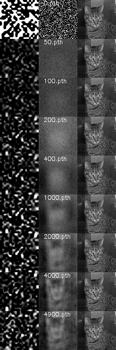
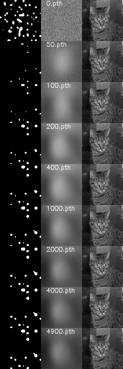
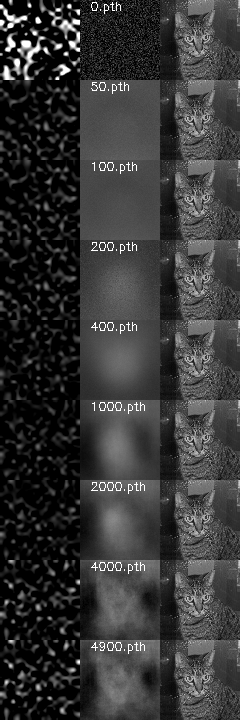
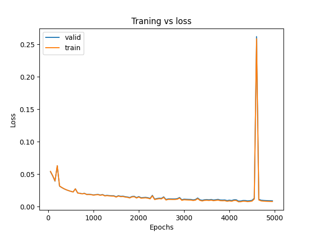
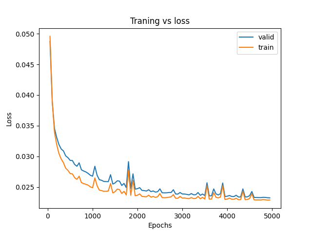
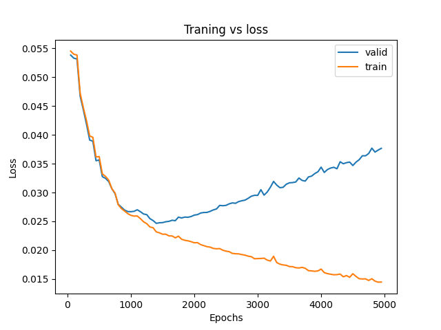

# Autoencoder test

Playing around with autoencoders to see which gives the best representation

For this simple test case the linear model seems to perform visually best.

## Models tested 

Linear autoencoder

Non linear autoencoder with relu on encoder and sigmoid on decoder

Non linear autoencoder with relu on encode and decode with various hidden layers

## Results

Upsampled encoded space, reconstruced image and original image

  
Linear model vs nonlinear vs nonlinearv2

  

    <td></td>
    <td></td>
    <td></td>
  

  

    <td></td>
    <td></td>
    <td></td>
  

  
The linear and first non linear remains stable, the nonlinearv2 starts overfitting

# Dataset:

[Cats and Dogs Classification Dataset](https://www.kaggle.com/datasets/bhavikjikadara/dog-and-cat-classification-dataset/data)

# Installation

Create a venv and install torch, opencv, numpy

Download the dataset and populate the project folders
